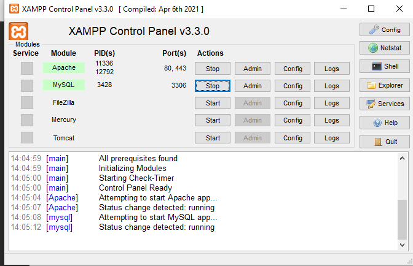
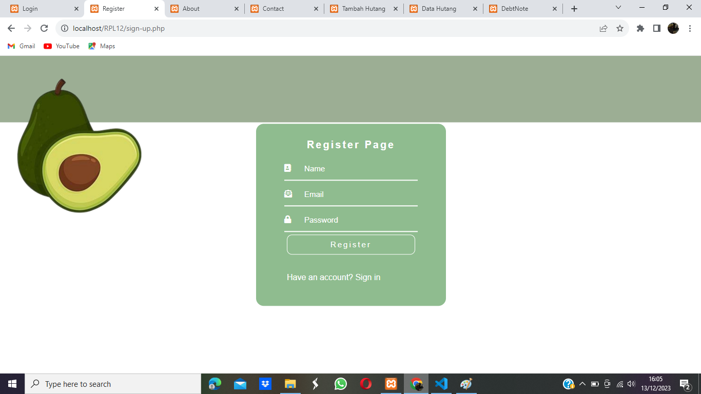
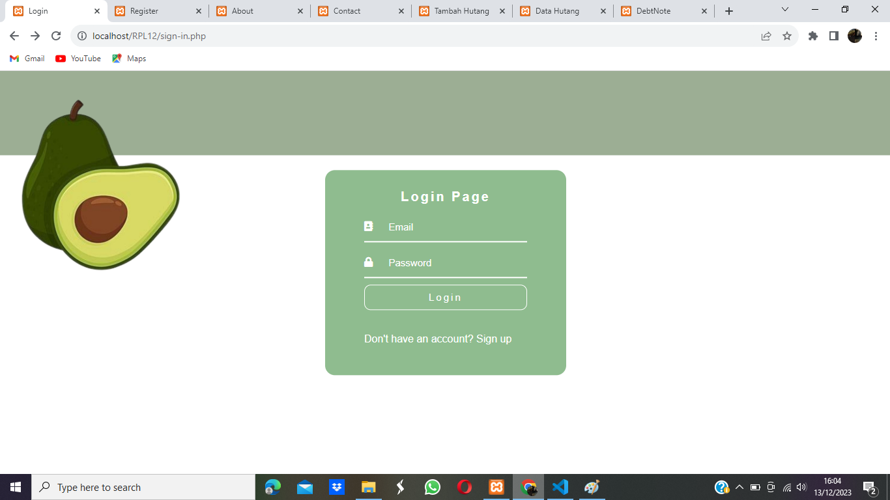

# DebtNote - Register & Login

DebtNote adalah jenis aplikasi web yang dirancang untuk membantu pengguna melacak dan mengelola catatan hutang dan pinjaman. Aplikasi ini memungkinkan pengguna untuk mencatat informasi tentang hutang yang mereka miliki atau hutang yang harus mereka bayar kepada pihak lain. Tujuan utama dari website pencatat hutang adalah untuk membantu pengguna mengelola keuangan mereka dengan lebih baik.

### 1. Menghubungkan Code PHP ke website PhpMyAdmin dengan menggunakan XAMPP


### 2. Buatlah Database Register & Login pada bagian PhpMyAdmin, dengan id_pengguna sebagai Primary Key

```PHP
CREATE TABLE tb_pengguna (
    id_pengguna int(10) AUTO_INCREMENT PRIMARY KEY,
    name varchar(100),
    email varchar(100),
    password varchar(100)
);
```

### 3. buatlah form Register dengan nama sign-up.php

```PHP
<!DOCTYPE html>
<html>
<head>
    <meta charset="UTF-8">
    <meta http-equiv="X-UA-Compatible" content="IE=edge">
    <meta name="viewport" content="width=device-width, initial-scale=1.0">
    <link rel="stylesheet" href="https://use.fontawesome.com/releases/v5.6.3/css/all.css">
    <title>Register</title>
</head>
<body>
    <div class="input">
        <h1>Register Page</h1>
        <link href="style-awal.css" rel="stylesheet" type="text/css" />
        <form action="sign-up.php" method="post">
            <div class="box-input">
                <i class="fas fa-address-book"></i>
                <input type="text" placeholder="Name" name="name">
            </div> 
            <div class="box-input">
                <i class="fas fa-envelope-open-text"></i>
                <input type="email" placeholder="Email" name="email">
            </div>
            <div class="box-input">
                <i class="fas fa-lock"></i>
                <input type="password" placeholder="Password" name="password">
            </div>   
            <button type="submit" name="register" class="btn-input">Register</button>
            <div class="bottom">
                <p>Have an account?
                    <a href="sign-in.php">Sign in</a>
                </p>
            </div>    
        </form>
    </div>
</body>
</html>
```

### 4. buatlah form Register dengan nama sign-in.php

```PHP
<!DOCTYPE html>
<html>
<head>
    <meta charset="UTF-8">
    <meta http-equiv="X-UA-Compatible" content="IE=edge">
    <meta name="viewport" content="width=device-width, initial-scale=1.0">
    <link rel="stylesheet" href="https://use.fontawesome.com/releases/v5.6.3/css/all.css">
    <title>Login</title>
</head>
<body>
    <div class="input">
        <h1>Login Page</h1>
        <link href="style-awal.css" rel="stylesheet" type="text/css" />
        <form action="sign-in.php" method="post">
            <div class="box-input">
                <i class="fas fa-address-book"></i>
                <input type="text" placeholder="Email" name="email">
            </div> 
            <div class="box-input">
                <i class="fas fa-lock"></i>
                <input type="password" placeholder="Password" name="password">
            </div>   
            <button type="submit" name="login" class="btn-input">Login</button> 
            <div class="bottom">
                <p>Don't have an account?
                    <a href="sign-up.php">Sign up</a>
                </p>
            </div>
        </form>
    </div>  
</body>
</html>
```

### 5. Sekarang, buatlah PHP agar fom yang sudah dibuat bisa terhubung langsung database nya ke PhpMyAdmin

```PHP
// PHP For Sign-Up 

<?php
include('koneksi.php');

if (isset($_POST['register'])) {
    $name = mysqli_real_escape_string($conn, $_POST['name']);
    $email = mysqli_real_escape_string($conn, $_POST['email']);
    $password = mysqli_real_escape_string($conn, $_POST['password']);

    // Hash the password for security
    $hashedPassword = password_hash($password, PASSWORD_DEFAULT);

    $sql = "INSERT INTO tb_pengguna (name, email, password) VALUES (?, ?, ?)";
    
    $stmt = mysqli_prepare($conn, $sql);
    mysqli_stmt_bind_param($stmt, "sss", $name, $email, $hashedPassword);
    $result = mysqli_stmt_execute($stmt);

    if ($result) {
        echo "<script>alert('Pendaftaran berhasil');</script>";
        echo "<script>window.location='dashboard.php';</script>";
    } else {
        echo "<script>alert('Pendaftaran gagal');</script>";
    }

    mysqli_stmt_close($stmt);
}
?>

// PHP For Sign-in

<?php
session_start();
include('koneksi.php');

if (isset($_POST['login'])) {
    $email = $_POST['email'];
    $password = $_POST['password'];

    $sql = "SELECT * FROM tb_pengguna WHERE email='$email'";
    $result = mysqli_query($conn, $sql);

    if (!$result) {
        die("Connection failed: " . mysqli_connect_error());
    }

    $count = mysqli_num_rows($result);

    if ($count == 1) {
        $row = mysqli_fetch_assoc($result);
        if (password_verify($password, $row['password'])) {
            $_SESSION['email'] = $email;
            echo "<script>alert('Login Berhasil');</script>";
            echo "<script>window.location='dashboard.php';</script>";
        } else {
            echo "<script>alert('Password Salah');</script>";
        }
    } else {
        echo "<script>alert('Email tidak ditemukan');</script>";
    }
}
?>
```

# HASIL



